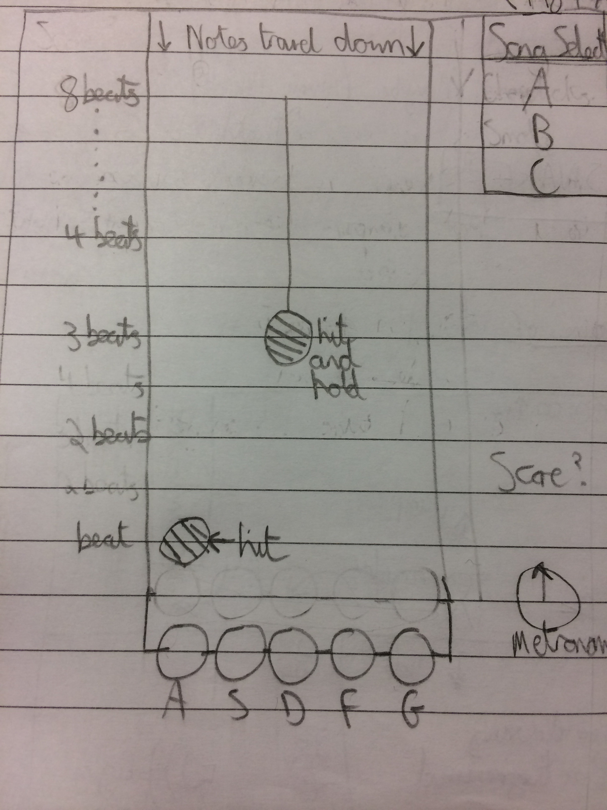

# Sparta Core Project One

## Web Browser Rhythm Game

### Contents

* [Software and Dependencies](#software-and-dependencies)
* [Installation](#installation)
* [Requirements](#requirements)
* [User Stories](#user-stories)
* [The Game](#the-game)
* [Code Extracts](#code-extracts)

## Software and Dependencies

This project was built using the following programming and markup languages:

* HTML
* CSS
* Javascript

The project also used the following frameworks, sourced locally:
* [Bootstrap 3.3.7](https://getbootstrap.com/docs/3.3/)
* [jQuery 3.3.1](https://jquery.com/)

### Installation

Access the project repository at: [bjorobinson/Sparta-core-project-one](https://github.com/bjorobinson/Sparta-core-project-one).

Clone the repository by copying below into the desired directory:
`git@github.com:bjorobinson/Sparta-core-project-one.git`. The dependencies will also be downloaded.

Load the game by running `index.html` in the newly created directory.

## Requirements

The task set was to create a browser-based game using HTML, CSS, and Javascript. The game itself had to meet the following basic requirements:

* The idea must be approved by the trainers.
* The game must include a set of instructions on how to play.
* The game must include a message saying if the player has won or lost at the end, as well as a score, if applicable.
* The game must be styled, and hosted online.

### User stories

The User Stories of this project were tracked with the online management system: [Trello](https://trello.com/). The project consisted of two sprints of equal length, and below is a summary of the user stories covered in each of these sprints.

#### Sprint One

The User Stories of Sprint One were aimed at producing a Minimum Viable Product, and so covered the core functionality and the project basic requirements. For example:

* As a user, I want to see 5 colour coded nodes at the bottom of the screen.
* As a user, I want immediate feedback that I have hit the right notes at the right point in time.
* As a user, I want there to be a score counter that increases as you hit the right notes

##### Wireframe

Below is the first wireframe drawn to try to bring together and show what the program would look like. The project changed a great deal during development, so while it accurately shows an outline, it differs a great deal from the final product.



##### Issues

The following features were planned to be part of the MVP and final product, but were cut after the end of sprint one due to time constraints.
* Multiple Songs
* Having two notes to hit at the same time
* Having notes to hit and hold
* An animated metronome

#### Sprint Two

With the MVP created. Sprint Two focused on extra features to enhance the core features. For example:

* As a user, I want to be able to decide when the song starts
* As a user, I want to hear four drum taps counting me in
* As a user, I want the ui to look visually appealing

##### Successes and Challenges

The greatest challenge of sprint two was ensuring the sync between the song and the notes to be played was close. This was solved with the use of repeated calls to a single function that handled most timings, which is elaborated on further in the Code Extracts section.

# The Game

The game is a rhythm game inspired, in both gameplay and style, by Guitar Hero and Rock Band. It has been tuned for the player to 'play' through Queen - We Will Rock You.

## Instructions

Click the Begin Song button to begin the game. Match the coloured notes with their corresponding keys when the notes reach the accept zone, denoted by the gold pickup in the background image. A matched note will score a point, a missed note will lose a point, a note played when one is not due will also lose a point.

## Screenshot


## Code Extracts

This section is dedicated to pieces of code that form fundamental pieces of the program. These extracts are all part of `js/app.js`.

### The Timing

Timing of the notes is key during runtime, and most functions in app.js that involve time call this function, to wait for a set period of time,at some point:

```javascript
function spawnRest(){
  setTimeout(function(){
  },globDelay)
  globDelay += globDelayIt;
}
```
Where
```Javascript
var globDelay = 0;
```
Is the cumulative time each new calling of the function must wait
```Javascript
var globDelayIt = 60000 / (81 * 2);
```
Is the iterator that is added to globDelay on each call. The value represents the time between each 1/2 beat in ms, for a song that is 81 BPM.

### The Input

Below is the definition of where the user input is stored, and the functions that handle input on a keydown and keyup event call. For the purpose of this explanation, I'd ask to draw your attention to the code that specifically deals with the `input` variable.

```javascript
var input = {}
...
$(document).keydown(function(event){
  if (jQuery.inArray(event.which,acceptedKeys)!=-1) {
    var keycode = event.which
    input[keycode] = true;
    addPushed($("#" + whatButton(keycode)));
    hasNote(whatButton(keycode));
  }
});
...
$(document).keyup(function(event){
  var keycode = event.which
  delete input[keycode];
  removePushed($("#" + whatButton(keycode)));
});
```
`input` in this program is an object, as opposed to, for example, an array. When a button is pressed, the colour keycode is then created as a key to the object. This had the following benefits:
* Javascript objects cannot have duplicate keys, so repeated calls of the keydown function (through holding the key down) will do nothing.
* `delete object[key]` is far easier than removing a member from an array, which may have required me to keep constant track of the index and contents of the input array.
