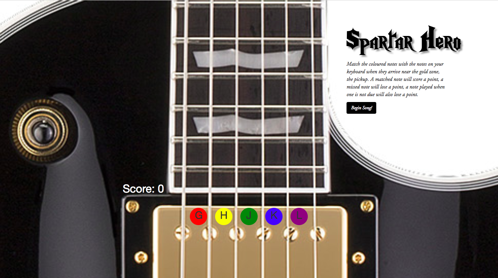

# Sparta Core Project One

## Web Browser Rhythm Game

### Contents

* [Software and Dependencies](#software-and-dependencies)
* [Installation](#installation)
* [Requirements](#requirements)
* [User Stories](#user-stories)
* [The Game](#the-game)

## Software and Dependencies

This project was built using the following programming and markup languages:

* HTML
* CSS
* Javascript

The project also used the following frameworks, sourced locally:
* [Bootstrap 3.3.7](https://getbootstrap.com/docs/3.3/)
* [jQuery 3.3.1](https://jquery.com/)

### Installation

Access the project repository at: [bjorobinson/Sparta-core-project-one](https://github.com/bjorobinson/Sparta-core-project-one).

Clone the repository by copying below into the desired directory:
`git@github.com:bjorobinson/Sparta-core-project-one.git`. The dependencies will also be downloaded.

Load the game by running `index.html` in the newly created directory.

## Requirements

The task set was to create a browser-based game using HTML, CSS, and Javascript. The game itself had to meet the following basic requirements:

* The idea must be approved by the trainers.
* The game must include a set of instructions on how to play.
* The game must include a message saying if the player has won or lost at the end, as well as a score, if applicable.
* The game must be styled, and hosted online.

### User stories

The User Stories of this project were tracked with the online management system: [Trello](https://trello.com/). The project consisted of two sprints of equal length, and below is a summary of the user stories covered in each of these sprints.

#### Sprint One

The User Stories of Sprint One were aimed at producing a Minimum Viable Product, and so covered the core functionality and the project basic requirements. For example:

* As a user, I want to see 5 colour coded nodes at the bottom of the screen.
* As a user, I want immediate feedback that I have hit the right notes at the right point in time.
* As a user, I want there to be a score counter that increases as you hit the right notes

#### Sprint Two

With the MVP created. Sprint Two focused on extra features to enhance the core features. For example:

* As a user, I want to be able to decide when the song starts
* As a user, I want to hear four drum taps counting me in
* As a user, I want the ui to look visually appealing

# The Game

The game is a rhythm game inspired, in both gameplay and style, by Guitar Hero and Rock Band.

## Instructions

Click the Begin Song button to begin the game. Match the coloured notes with their corresponding keys when the notes reach the accept zone, denoted by the gold pickup in the background image. A matched note will score a point, a missed note will lose a point, a note played when one is not due will also lose a point.

## Screenshot

